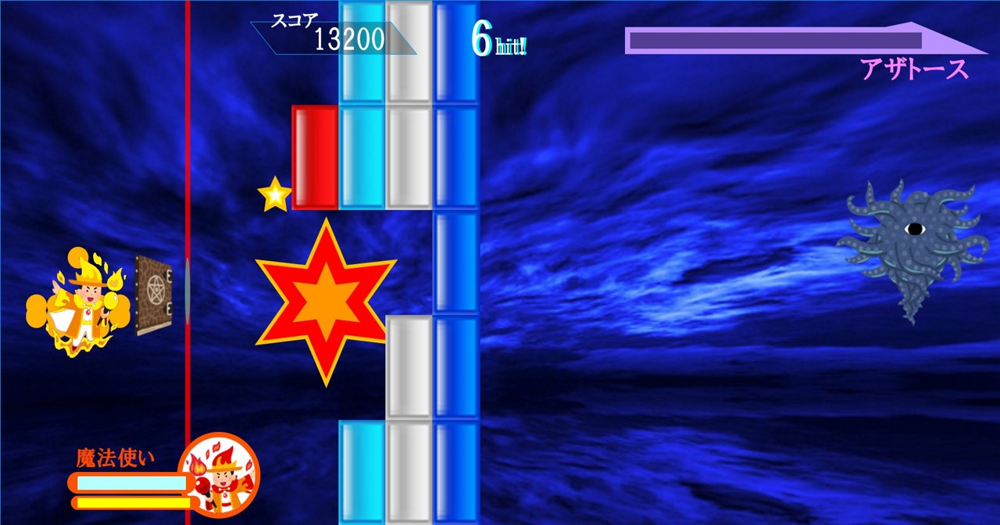

 
  

<h1 align="center"> Star of the Wizard </h1>
<h3 align="center"> 情報表現入門Ⅰ(2021年前期) - 公立はこだて未来大学 </h3>

 
  

## はじめに
このゲームはprocessingと呼ばれる言語で作成したブロック崩しの一種です。敵であるアザトースとの戦闘を楽しめます。

## ゲームの概要
- タイトル画面から戦闘シーンに移るときに、processingで作成した敵の登場を演出する映像が流れます。
- 敵であるアザトースが一定時間ごとに5行5列のブロックを一列ずつ展開してきます。
- 一定ダメージをアザトースに与えるとアザトースが覚醒し、10行5列のブロックを展開するようになります。
- 普通のブロック崩しと違い、ただ弾を反射させるだけではブロックを削りきることができません。自分なりのテクニックや必殺技を使う必要があります。
- 必殺技を使えるようになると、プレイヤーがエフェクトをまとい、派手な効果音とともにブロックを一気に削る弾を放てるようになります。

## ゲームの操作方法
- マウスでプレイヤーを上下に移動します。
- fキーでスターを発射します。
- gキーで必殺技を発動します。

## ゲームの紹介動画

次のリンクからゲームの紹介動画を見ることができます。
https://youtu.be/k4SLyvW7P2Y?si=-nqz-PI-V29mR3XM

## ゲームのプレイ方法
- processing言語の[公式サイト](https://processing.org/download)からprocessingをダウンロードしてインストールします。
- このリポジトリをダウンロードします。
- processingを起動して、ダウンロードしたpdeファイルを開きます。
- 実行ボタンを押してゲームを開始します。
